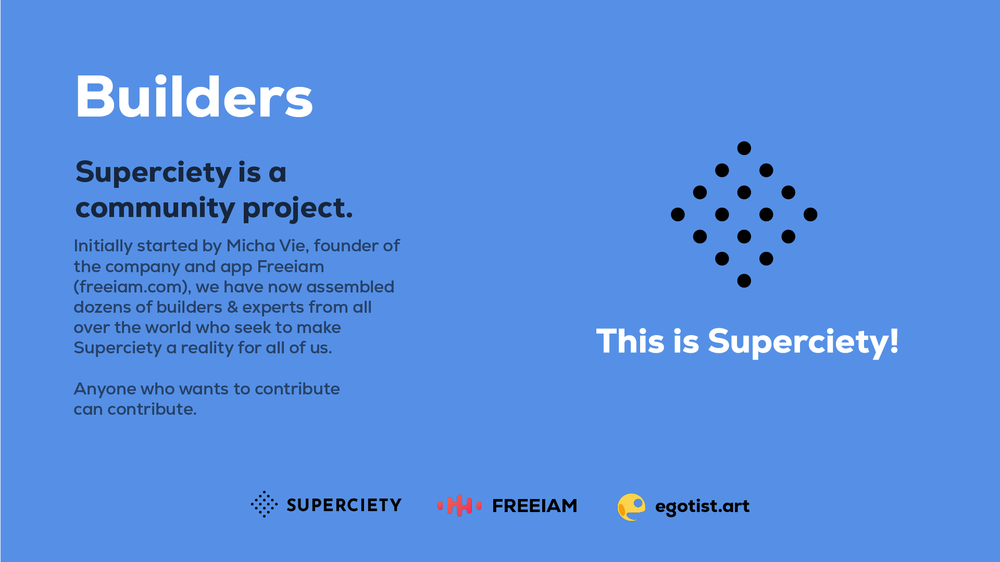

# Litepaper

> Superciety has been progressing fast, has learned many new things, and is at the point where many of the described features are already live on mainnet. For this reason, this paper is considered deprecated.

## Abstract

Superciety is an ecosystem of distributed power, collaboration & fun. A social infrastructure that allows builders all around the world to come together and work on something they believe in – a shared goal & philosophy. Building a better society, a super society is just a side-effect. In all of that, we care about creating automated & autonomous systems with a minimum of bureaucracy, full transparency, and shared ownership that serves the general public. This is our way of creating the ever-promised society of the people, by the people, for the people.

Over the years Superciety will release many products & services, but most importantly, we see Superciety as a product in itself. One that needs constant improvements (product iterations) based on the constructive feedback received from the community (fast feedback-loops). It's our way of working.

Supercitizens are people like you and me, and the way we know each other is through the identity service we call SUPERID. SUPERID contains information about us that is used to prove authenticity & trust to the people we interact with & potentially work within Superciety. This may include personal information like your name, your origin, a free-to-chose picture in form of an NFT, a trust level, social connections, past contributions, and many other data points that help give people an idea of who we are. SUPERID is how people know you in Superciety.

Superciety is a place where anyone can start or find self-sufficient communities that work towards a shared goal. They operate using their own ESDT token as a financial resource and have their own governance system in place. We call these communities Fellowships. They have many similarities to what we know as DAOs (Decentralized Autonomous Organization) and are a place of progress, fun, purpose & belonging. Supercitizens can contribute to the progress of Fellowships with their unique set of skills & talents, and get rewarded for their contributions in a trustless form in the native ESDT token of a Fellowship. These rewards will be newly minted.

Working for a Fellowship means you are your own boss, your talents are your income source, and no one takes a huge cut on your earnings for being the middleman. Traits, that will attract experts in different fields that will help build tools that are owned by all Supercitizens. With Fellowships, you are not in a factory setting and your work will never be meaningless since you only work on what you choose to work on.

Whether you’re a developer, an artist, a visionary, or a temporary spectator, Superciety is where you will want to be. It is the modern way of work & collaboration.

Superciety will also offer a various and expanding set of public services. These will require its users to either hold or trade SUPER. A lot of these traded tokens will be burned, decreasing the total supply & possibly leading to SUPER becoming deflationary - or only slightly inflationary.

In addition to that, SUPER is also our governance token. Everyone who owns SUPER will be able to take part in community voting which steers the future of Superciety. Superciety itself will transition to being a fully autonomous Fellowship in the future. As a result of the above, the power of your vote is proportional to how useful you have been to the common good in the past.

The Superciety ecosystem is designed to shift wealth & voting power to those who are deliberately useful to the common good, which is not only leading to better decision making but most importantly taking away power from individuals that have proven damaging to our society in the past.

## Introduction

Societies have evolved over thousands of years from the human needs of conservation, belonging and prosperity. With the advent of settlements, the need for conservation has been met. However, the need for belonging, something deeply ingrained in all of us, is ever-present. Superciety is where you will find like-minded people with similar goals who are ready to go on an adventure with you. Often on the internet, sometimes in real life.

Our main focus is the individual, you, and distributing power among everyone involved. We are developing a social platform where SUPERIDs connect and help in building & growing decentralized & autonomous Fellowships. Superciety is a launchpad for individuals and projects rooted in the Elrond blockchain. A place for building, using and sharing community-owned tools for collaboration that will help grow a better society, with $SUPER as the base currency.

## Vision

Our vision is to create a solid foundation where individuals, known as Contributors, can share their skills and talents to earn income, or make a living in a trustless manner. We aim to create the central place of communities, driven by projects, called Fellowships that will undertake Quests to help build on the Elrond blockchain and will earn $SUPER or the Fellowships native ESDT as a reward.

We are building an ecosystem to solve problems and craft solutions. This is a place to connect the visionaries and the builders of a better society. Superciety’s building concept is simple. It is the place to connect contributors within an ecosystem of fellowships. Contributors can propose projects to the community to get constructive feedback, pull together the team of necessary resources, and start building. Every Supercitizen that is part of a fellowship is adding value and energy that is then rewarded in a trustless format, with $SUPER.
In this system, Fellowships can quickly become DAOs with their own ESDT token if determined necessary, or the financial model requires it. Basically anyone can develop a project and present it to Superciety.

Perhaps you are a construction engineer but you are passionate about editing videos. Here, you can release your creative genius to make presentations for your favorite causes, NFT’s or whatever fellowships you may be interested in. As the fellowship succeeds with your predetermined contributions, you will be rewarded in $SUPER.

## Why Superciety?

Supercitizens are at the heart of Supercity's operation and the platform will be governed entirely by the token holders. Votes will be carried out in proportion to the number of tokens held. Token holders will propel Fellowships by using $SUPER (or the native Fellowship ESDT) as the currency, paying to access community-owned products & services.
All Fellowships will have access to the various Quest Proposals being submitted. Maybe you need a logo for your project or some help on the development of a smart contract. Then, submit a quest! Contributors will be able to see your quest and offer their help. The quest can include an endowment, in $Super, for the contributor. To avoid any dispute, the reward tokens will be stored in a smart contract while the quest is being carried out.

But, what is the point of registering a fellowship on Superciety, besides the visibility?

The community of support and a vision for a better society!
To attract the top talent for the right fit, no matter what the project or Quest involves.
To use the launchpad and all the community-owned tools to envision, fund and strategically execute your project goals.

Every month, two springboards will be organized to promote the best projects in the ecosystem.

An innovation springboard, allowing all young fellowship leaders to be highlighted. Any young fellowships can apply for this event. $Super holders can elect their favorite project, which will be highlighted for a month on the platform.

A springboard booster, allowing all fellowships to present their unfinished projects to request participatory funding. $Super holders can vote for whichever they think will provide the most value, and it will be promoted for a month on the platform. For example, a $Super pool could be opened for two weeks for the winning project and the fellowship can then use those $Super for contributions! The fellowship may then provide tokens of their platform or various other incentives to encourage and reward the donors.

## On choosing Elrond Blockchain

To become an internet-scale blockchain you need speed (transaction throughput & finalization) and simplicity. Without speed, the blockchain will be in a constant state of congestion. Without simplicity, you won't even get to congesting your blockchain because of lacking user amounts.

We are building on Elrond blockchain because we believe that Elrond will become a global standard for decentralization & immutability of the internet.

Specifically, we chose Elrond blockchain because of:

- Wide distribution of nodes to ensure decentralization
- Popular developer tech stack
- Enormously fast-growing ecosystem
- Shared philosophy of extreme simplicity for end-users
- Environmental friendly (branded as Carbon-negative)

For more information visit [elrond.com](https://elrond.com).

With all the exciting growth within Elrond and all of the strategic steps the Elrond team is taking to push mass adoption, Superciety aims to be a central place for projects seeking to build communities of distributed power.

## How does it work?

Any user with a Maiar account can create a SUPERID and then log on to the platform and create a Fellowship in a matter of seconds.
To ensure clarity on the different metrics used for the visibility of all the projects on the platform, titles are granted. To qualify for a new rank, the individual fellowships must meet the predetermined criteria. Once the criteria are met, the passage to the next rank is enabled by way of a smart contract. A general overview of the titles are as follows:

"Young Fellowship": A minimum of information is required to be visible on the site. Once the project is submitted, it becomes visible only to contributors. All of the contributors involved must validate it in order to grant it the status of young fellowship, thus making the project visible to all.

"Fellowship”: This is the common grade given to communities that have been built and projects that have already been launched.

"Grand Fellowship”: This exceptional grade is given to the most successful projects in the ecosystem, and have an active community of at least 1000 registered members.

"Partner Fellowship”: This rank is awarded only to projects that have developed a partnership relationship with the Superciety project.

## Tokenomics

Initially, out of 10 million $SUPER:

- 80% were available for public sale
- 20% were reserved for giving away to the community (e.g. airdrop, giveaways, ...)

Superciety is a community project. There are no team reserves.

To list on Maiar Exchange, we temporarily locked 2 million $SUPER tokens from the public sale to provide initial liquidity (with the EGLD equivalent) to our swap pool. 6 million were sold at an initial price of 0.0001EGLD, which quickly doubled to 0.0002EGLD due to high demand.

1.2 million have been distributed to the community in form of airdrops in exchange for shares on Twitter, or other contributions.

Rewards for contributors of Fellowships will be newly minted, while strong burning mechanisms for costs of services) in Superciety will control the supply – potentionally making $SUPER deflationary in the long-term. The specifics of these mechanisms will be determined by Supercitizens through community voting.

With these factors in mind, the Superciety ecosystem is designed to shift wealth & voting power to those who are deliberately useful to the common good.

## Roadmap

## Builders

Superciety is a **community project**.

Initially started by Micha Vie, founder of the company and app Freeiam (freeiam.com), we have now assembled dozens of builders & experts from all over the world who seek to make Superciety a reality for all of us.

Anyone who wants to contribute can contribute.

This is Superciety.

